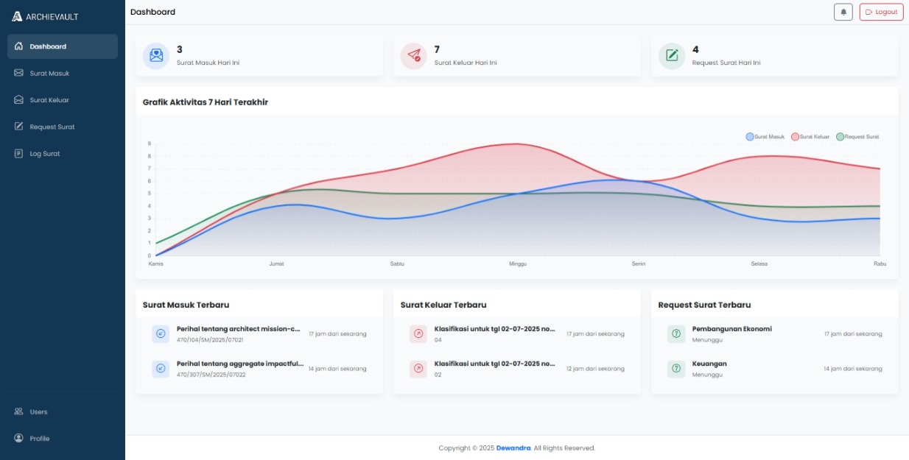
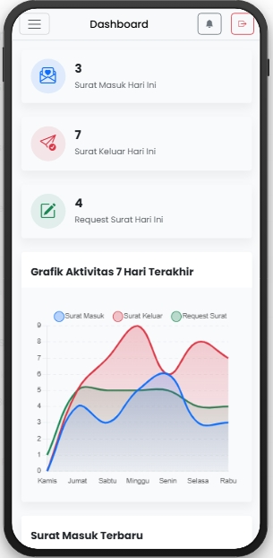
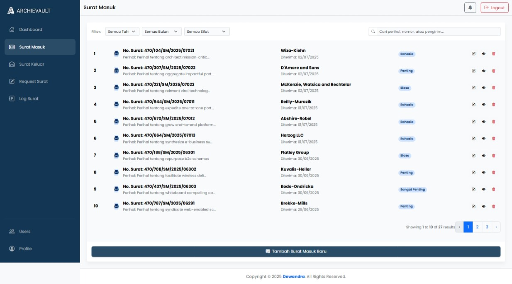
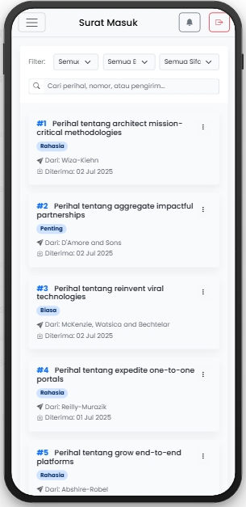
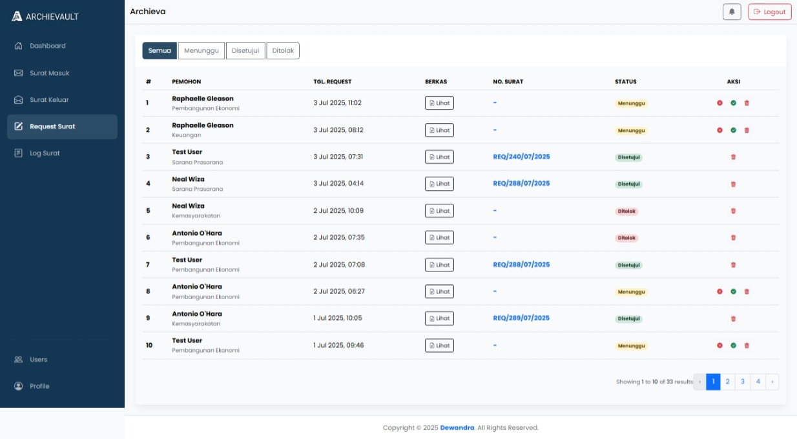
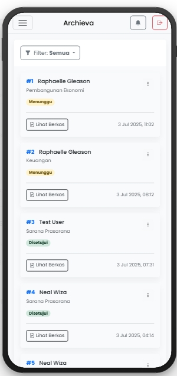
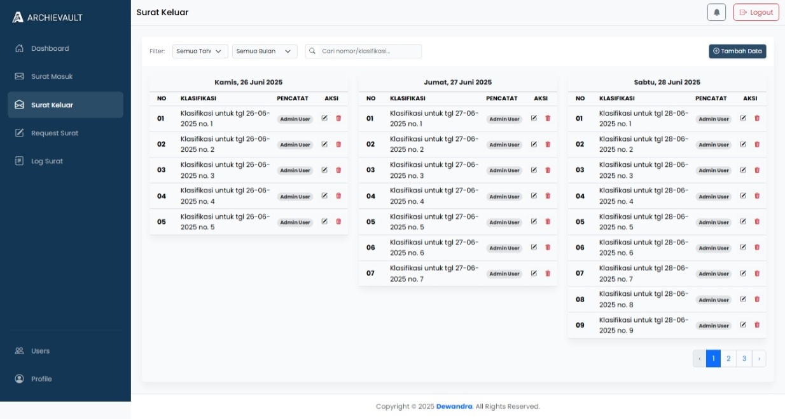
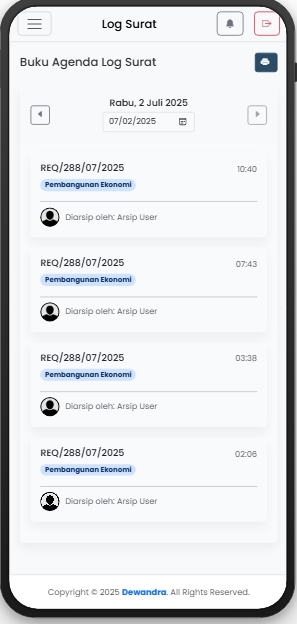

# Archievault - Sistem Manajemen Arsip Surat

<p align="center">
  
</p>

<p align="center">
  <a href="https://laravel.com" target="_blank"></a>
  <a href="https://livewire.laravel.com" target="_blank"></a>
  <a href="https://getbootstrap.com" target="_blank"></a>
  <a href="https://vitejs.dev" target="_blank"></a>
</p>

<p align="center">
  Aplikasi web modern untuk manajemen arsip surat masuk, surat keluar, dan disposisi secara digital. Dibangun dengan TALL Stack (Laravel, Livewire) dan Bootstrap 5.
</p>

## ✨ Fitur Unggulan

**Archievault** adalah solusi digital untuk menggantikan proses manual dalam pengelolaan arsip surat. Aplikasi ini dirancang untuk mempermudah pencatatan, pencarian, dan pelacakan alur surat dengan antarmuka yang bersih dan responsif di berbagai perangkat.

---

### 1. Dashboard Interaktif
Menampilkan ringkasan data penting seperti jumlah surat masuk, keluar, dan request hari ini. Dilengkapi dengan grafik aktivitas mingguan yang dinamis.

| Tampilan Desktop | Tampilan Mobile |
| :---: | :---: |
|  |  |

---

### 2. Manajemen Surat Masuk & Disposisi
Fitur lengkap (CRUD) untuk mengelola surat masuk, termasuk upload lampiran, pencatatan detail, dan disposisi ke berbagai bidang.

| Tampilan Desktop | Tampilan Mobile |
| :---: | :---: |
|  |  |

---

### 3. Request & Approval Surat oleh Bidang
Pengguna dengan role "Bidang" dapat mengajukan permohonan nomor surat. Admin atau Arsip kemudian dapat menyetujui atau menolak request tersebut.

| Tampilan Desktop | Tampilan Mobile |
| :---: | :---: |
|  |  |

---

### 4. Buku Agenda Surat Keluar & Log Surat
Pencatatan buku agenda untuk surat keluar dan halaman log untuk melacak semua surat yang telah diarsip, lengkap dengan fitur cetak laporan.

| Tampilan Desktop (Surat Keluar) | Tampilan Mobile (Log Surat) |
| :---: | :---: |
|  |  |

---

### Fitur Lainnya
-   **Manajemen Pengguna & Role:** Sistem *Role-Based Access Control* dengan 3 tingkatan (Admin, Arsip, Bidang).
-   **Profil Pengguna:** Pengguna dapat mengubah data pribadi, foto profil, dan password.
-   **Notifikasi Real-time:** Notifikasi untuk request baru dan persetujuan.
-   **Pencarian & Filter Lanjutan:** Memudahkan pencarian data berdasarkan berbagai kriteria.
-   **Desain Responsif:** Tampilan optimal di perangkat desktop maupun mobile.
-   **Cetak Dokumen:** Cetak lembar disposisi dan laporan log surat.

## 💻 Teknologi yang Digunakan
-   **Backend:** Laravel 11 🐘
-   **Frontend:** Livewire 3 ⚡️ & Bootstrap 5 🅱️
-   **Database:** MySQL (dengan dukungan untuk SQLite)
-   **Build Tool:** Vite
-   **Styling:** Sass, Bootstrap Icons
-   **Fitur Tambahan:** Chart.js, SweetAlert2

## 🚀 Instalasi & Konfigurasi

Ikuti langkah-langkah berikut untuk menjalankan proyek ini di lingkungan lokal Anda.

1.  **Clone repository**
    ```sh
    git clone [https://github.com/dewandra/archieva.git](https://github.com/dewandra/archieva.git)
    cd archieva
    ```

2.  **Install dependensi PHP**
    ```sh
    composer install
    ```

3.  **Buat file `.env`**
    ```sh
    cp .env.example .env
    ```

4.  **Generate application key**
    ```sh
    php artisan key:generate
    ```

5.  **Konfigurasi Database**
    Buka file `.env` dan sesuaikan pengaturan database Anda (DB_DATABASE, DB_USERNAME, DB_PASSWORD).

6.  **Jalankan Migrasi & Seeder**
    Perintah ini akan membuat struktur tabel dan mengisi data awal (user admin, surat, dll).
    ```sh
    php artisan migrate --seed
    ```

7.  **Buat Symbolic Link**
    Penting agar file yang di-upload (lampiran, foto profil) dapat diakses.
    ```sh
    php artisan storage:link
    ```

8.  **Install dependensi Node.js**
    ```sh
    npm install
    ```

9.  **Jalankan Vite development server**
    ```sh
    npm run dev
    ```

10. **Jalankan server Laravel**
    Buka terminal baru dan jalankan:
    ```sh
    php artisan serve
    ```

11. **Akses Aplikasi**
    Buka browser Anda dan kunjungi `http://127.0.0.1:8000`.

## 🧑‍💻 Akun Demo

Setelah menjalankan `migrate --seed`, Anda bisa login menggunakan akun berikut:

-   **Email:** `test@example.com`
-   **Password:** `password`

Anda dapat mengubah role pengguna ini melalui halaman "Users" untuk mencoba akses sebagai role yang berbeda.

## 📄 Lisensi

Proyek Archievault adalah perangkat lunak sumber terbuka yang dilisensikan di bawah [Lisensi MIT](https://opensource.org/licenses/MIT).